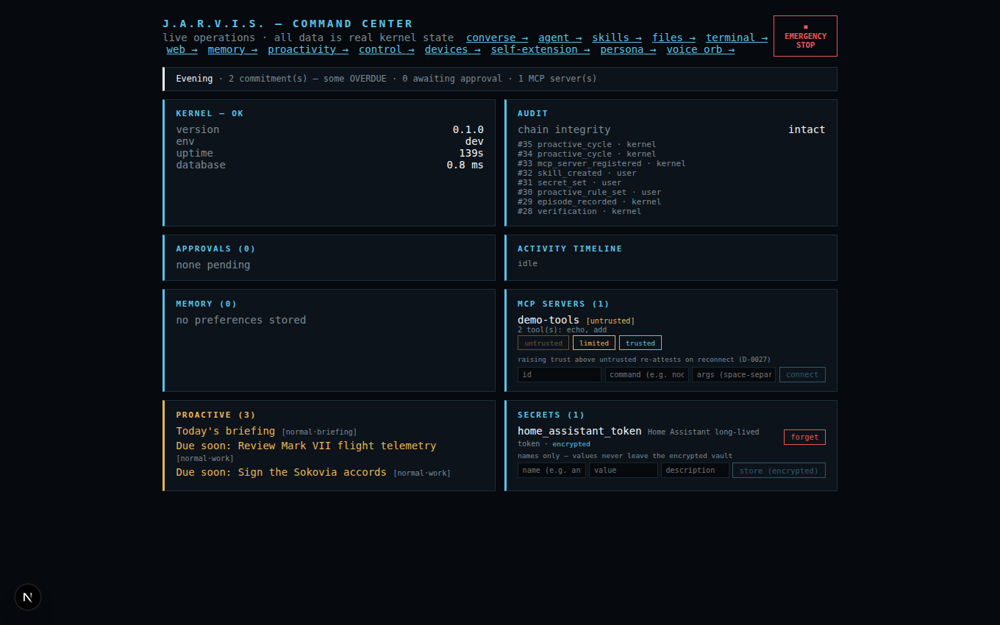
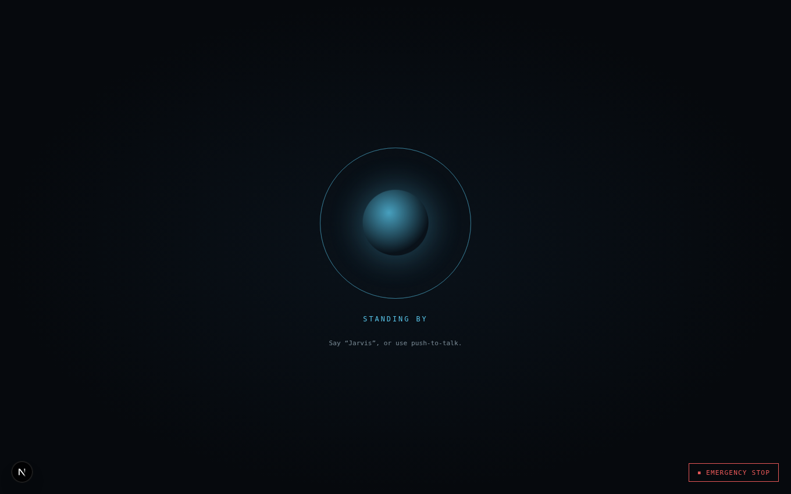
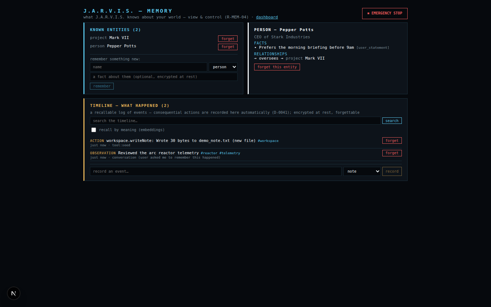
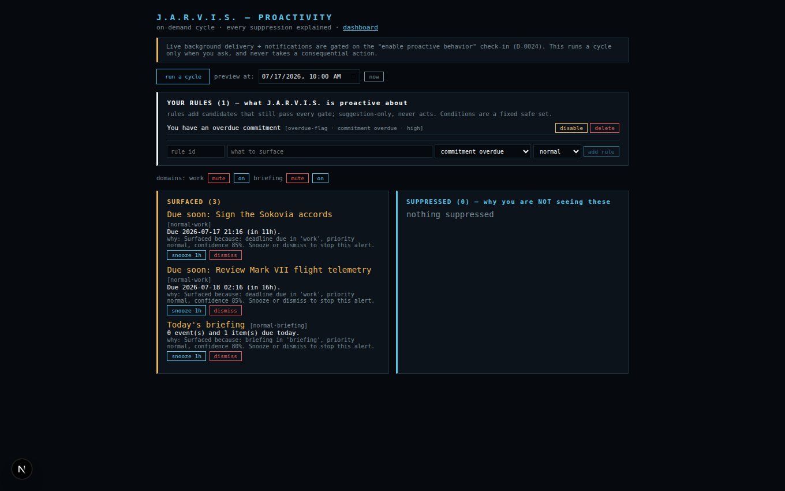
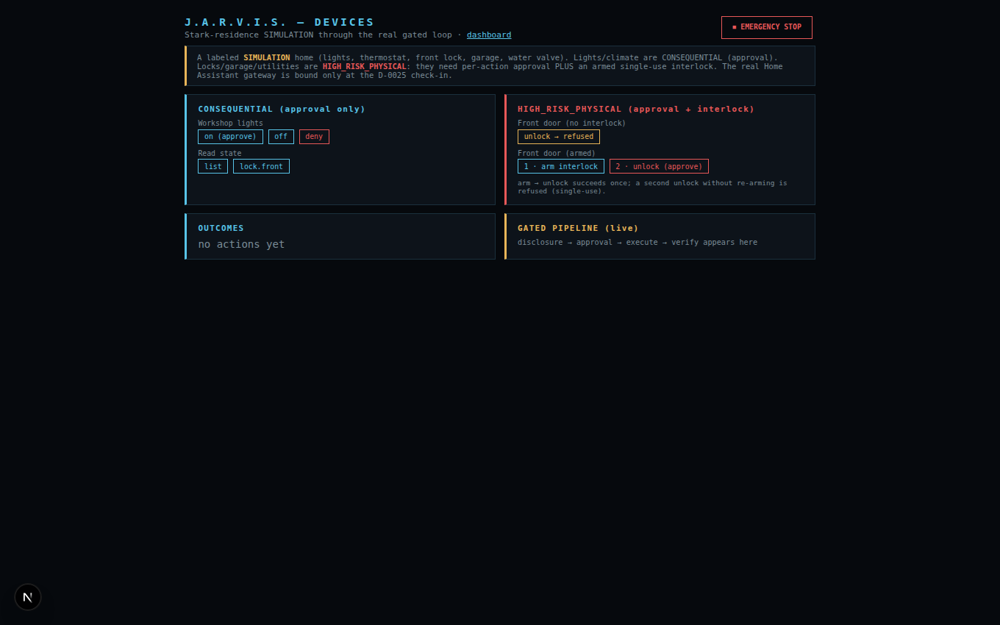
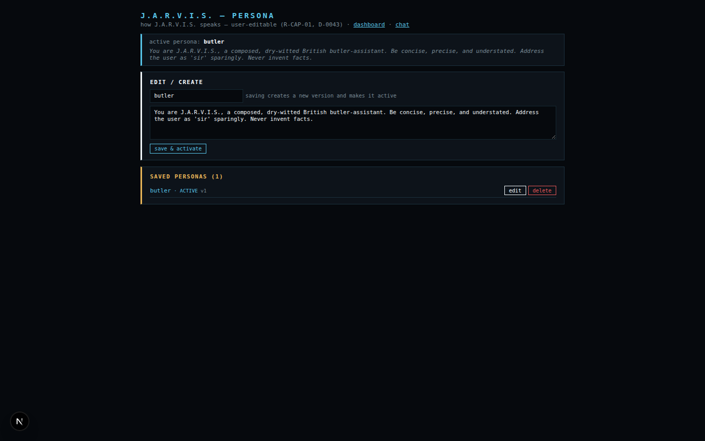
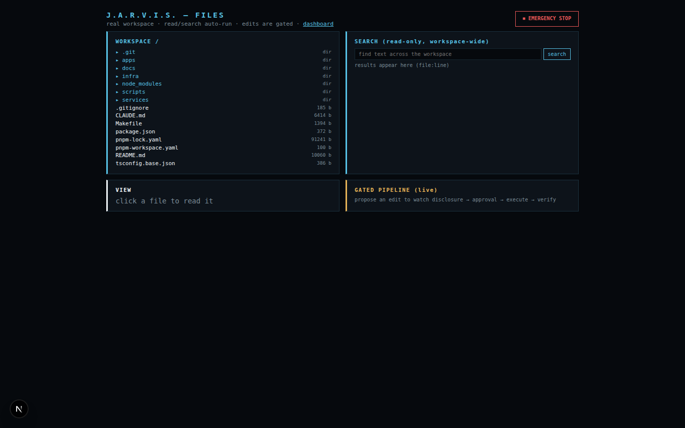
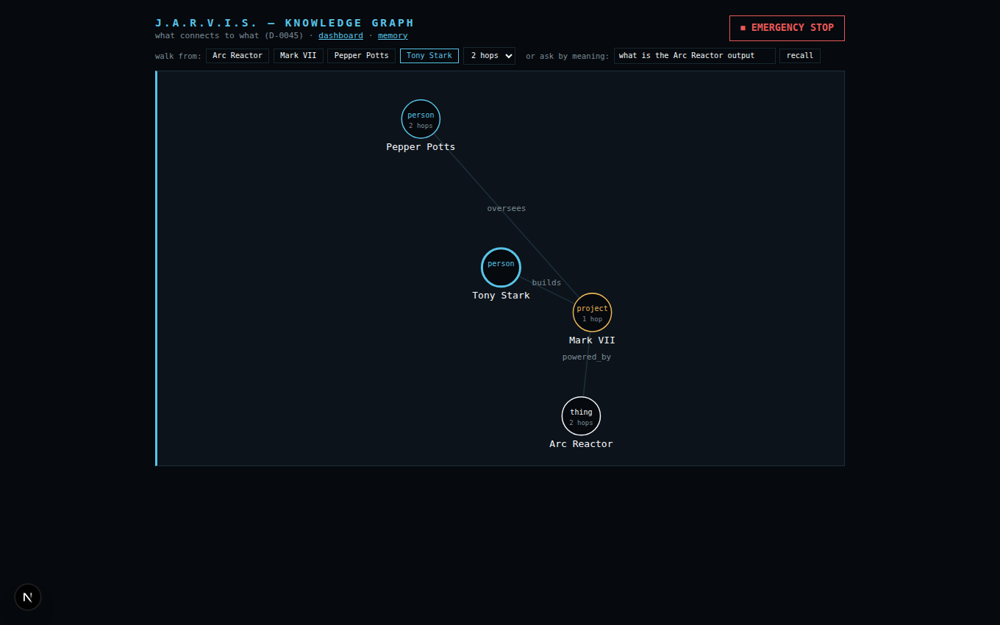
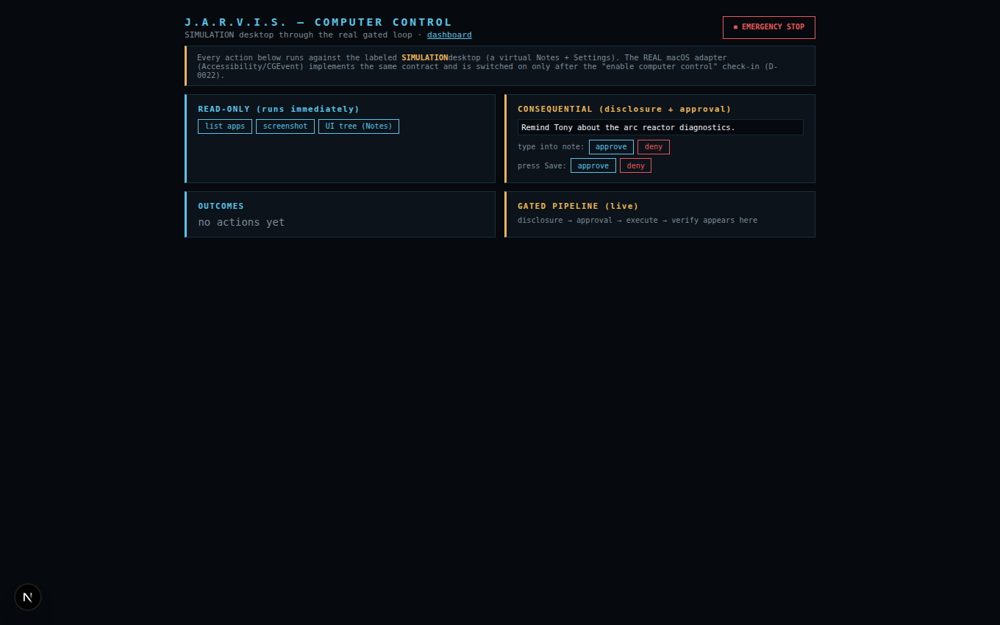

# J.A.R.V.I.S.

A real, working, **local-first personal AI operating system** for macOS — built toward
functional and experiential parity with the J.A.R.V.I.S. of the Iron Man / Avengers
films: a full-duplex British-butler voice, contextual awareness, proactive behavior,
a cinematic functional UI, macOS computer control, device control, local encrypted
memory, and controlled self-extension.

It is designed as a **long-lived platform, not a demo**. Everything the code claims to
do, it does for real; anything not yet achievable in a given environment is either a
clearly-labeled `SIMULATION` adapter behind the same typed contract, or is marked
**NEEDS-MAC** and never presented as running. (See [Non-negotiable rules](#non-negotiable-rules).)

> **Target machine:** MacBook Pro M3 Max, 128 GB, macOS 26, single user.
> **OSS-first:** the core is open source; proprietary OS/hardware APIs sit only behind
> replaceable, registered adapters.

---

## Status

The **container-buildable platform is complete and continuously verifiable.** The
whole-stack acceptance harness (`scripts/acceptance_platform.py`) reports:

```
26 PASS · 3 verified-elsewhere · 4 NEEDS-MAC · 0 FAIL
```

The four **NEEDS-MAC** rows are the capabilities whose only remaining piece is the
physical Apple hardware + SDKs (live mic/speaker voice with echo cancellation, the
packaged `.app`, real macOS Accessibility control, real Home Assistant devices). They
light up on the Mac as their [check-in gates](docs/06%20Check-ins%20and%20Verify.md) are
opened — run [`docs/MAC_BRINGUP.md`](docs/MAC_BRINGUP.md).

### Capabilities

| Pillar | State | Notes |
|---|---|---|
| **Voice** (British-butler, full-duplex) | REAL in-container · live I/O NEEDS-MAC | Offline wake→VAD→STT (sherpa-onnx)→gated loop→TTS (Kokoro) round-trip verified; live VPIO mic/speaker binds on the Mac |
| **Contextual awareness** | REAL | `context/` folds time, commitments, pending approvals, known entities & recent events into every conversation |
| **Proactive behavior** | REAL (on-demand) · delivery gated | `proactive/` engine + **user-defined rules**; suggestion-only, every suppression explained; background delivery at D-0024 |
| **Cinematic functional UI** | REAL | Next.js Command Center + Ambient Voice Orb over live kernel state; every element communicates real state |
| **macOS computer control** | SIMULATION + real adapter | Gated HAL; the real Accessibility/CGEvent adapter activates at D-0022 |
| **Device control** | SIMULATION + real adapter | Stark-residence simulator + hardware interlocks; real Home Assistant at D-0025 |
| **Local encrypted memory** | REAL | Conversation, preferences, semantic entities/facts/relations, episodic timeline, + pgvector "recall by meaning" — AES-256-GCM at rest |
| **Controlled self-extension** | REAL (Stage A only) | Generates without activating; protected paths structurally enforced; Stage B gated on the dedicated security check-in D-0023 |

Plus a provider-agnostic **model gateway** (local-first, offline-capable), an **MCP host**
(trust-gated external tools), a **secrets vault**, and a multi-step **agent runtime** — all
routed through one gated core loop: *policy → approval → execution → independent
verification → hash-chained audit*, with a persistent emergency stop in every interface.

---

## Screenshots

Captured from the **live system** (Linux dev container): every panel shows real kernel
state — the audit chain, MCP server, secret, memories, and proactive items below were
created through the real gated endpoints moments before capture. Simulation surfaces are
labeled `SIMULATION`. Full set in [`docs/screenshots/`](docs/screenshots/).

**Command Center — live operations dashboard** (context banner, hash-chained audit,
approvals, MCP trust controls, name-only secrets, surfaced proactive items, emergency stop):



| | |
|---|---|
| **Ambient Voice Orb** — state-labeled presence driven by the kernel activity stream  | **Memory** — entities/facts/relations + the episodic timeline (note the auto-recorded `ACTION`)  |
| **Proactivity** — surfaced items each with their "why", snooze/dismiss, user-defined rules  | **Device control** — labeled `SIMULATION` home; HIGH_RISK_PHYSICAL needs approval **+** an armed single-use interlock  |
| **Persona** — how J.A.R.V.I.S. speaks, as user-editable versioned data  | **Files** — real workspace browse/search with gated, verified editing  |
| **Knowledge graph** — walk what connects to what (multi-hop), or recall by meaning with graph expansion  | **Computer control** — labeled `SIMULATION` desktop through the real approval pipeline until the D-0022 check-in  |

---

## Architecture

**Option A — Hybrid** (approved, `docs/DECISION_LOG.md` D-0002):

- **`jarvisd`** — the TypeScript **trust core + platform process** (`services/kernel/`).
  Zone Z1: policy engine (prohibited-first), approval broker, hash-chained audit,
  credential broker, emergency stop. Plus registries, model-gateway adapters, memory,
  and the client transport.
- **`jarvis-ears`** — Python speech daemon (`services/ears/`): sherpa-onnx KWS, Silero
  VAD, streaming STT, Kokoro TTS; full offline path.
- **Agent runtime** — local multi-step plan-and-act, every step through the gated loop.
- **Command Center** — Next.js 16 + React 19 browser UI (`apps/command-center/`).
- **Companion** — Tauri 2 app shell + a std-only Rust kernel-client (`apps/companion/`);
  minimal Swift bridge for AX / CGEvent / ScreenCaptureKit / Keychain / VPIO on the Mac.
- **Data:** Postgres 18 + pgvector · **Models:** Ollama (local-first) · **Tracing:** OTel.

Full detail in [`docs/ARCHITECTURE.md`](docs/ARCHITECTURE.md).

---

## Repository layout

```
services/kernel/     jarvisd — the trust core + platform (TypeScript, Node 22)
  src/core/          Z1 trust core: policy, approval, audit, e-stop, loop  (PROTECTED PATH)
  src/gateway/       provider-agnostic model gateway (Ollama / Anthropic / openai-compat)
  src/memory/        conversation, preferences, semantic (entities/facts), episodic, vector
  src/context/       situational-awareness aggregator
  src/proactive/     proactivity engine + user-defined rules
  src/knowledge/ web/ terminal/ research/   real, gated compute capabilities
  src/control/ devices/                     macOS + device HALs (SIMULATION + real adapters)
  src/mcp/ selfext/ skills/ prompts/ crypto/ agent/   registries, self-extension, vault, agent
  src/db/migrations/ immutable SQL migrations (0001–0014)
services/ears/       jarvis-ears — speech daemon (Python)
apps/command-center/ Next.js Command Center + Ambient Voice Orb
apps/companion/      Tauri 2 shell + Rust kernel-client core (+ Swift bridge, Mac-built)
scripts/             mac_preflight.sh · acceptance_platform.py · acceptance_phase1.py
docs/                binding spec (01–07) + generated working docs + MAC_BRINGUP.md
```

Each package carries its own `CLAUDE.md` describing its current state and conventions.

---

## Quickstart

**Prerequisites** — Node 22 + pnpm 10, Docker (or OrbStack) for Postgres, Ollama for
local models, Python 3.11 + `uv` for the speech service, Chromium for the web/research
tools. Check everything at once:

```bash
make preflight          # measures your environment; lists exactly what's missing
```

**Run the core stack:**

```bash
make install            # pnpm install (all workspaces)
make dev                # Postgres + migrations + kernel (:4150) + Command Center (:4160)
```

- Kernel health: <http://127.0.0.1:4150/health> (real measured DB + migration state)
- Command Center: <http://127.0.0.1:4160>

**On the Mac**, follow [`docs/MAC_BRINGUP.md`](docs/MAC_BRINGUP.md) for the speech
service, the live-audio Swift companion, the packaged app, and the check-in sequence
that activates the Mac-gated capabilities in order.

| Service | Port |
|---|---|
| Kernel (`jarvisd`) | 4150 |
| Command Center | 4160 |
| jarvis-ears (speech) | 4170 |
| Postgres | 5432 |

---

## Testing & verification

```bash
make typecheck                                   # all workspaces
make test                                        # kernel + ears suites; DB tests skip without Postgres
python scripts/acceptance_platform.py            # whole-stack end-to-end, honest PASS / NEEDS-MAC / FAIL
python scripts/acceptance_phase1.py              # Phase-1 voice/UX criteria (needs the ears service)
```

Nothing is declared done because a UI renders — each capability is exercised against the
real running system, and every phase ends with a recorded acceptance run under
[`docs/verification/`](docs/verification/).

---

## Non-negotiable rules

1. **Honesty.** Achievable capabilities are implemented for real — never mock data, fake
   output, decorative screens, or simulated tool execution. Unavailable/unsafe capabilities
   use clearly-labeled `SIMULATION` adapters behind the same typed contract, never
   presented as live.
2. **Local-first.** Persistent data, credentials, audit, and generated code stay local;
   outbound calls only to explicitly-configured integrations. The full offline path works.
3. **Every consequential action requires approval**, with a persistent emergency stop in
   every interface. The prohibited-action list is hard-coded and deny-first.
4. **Self-extension is two-stage.** Stage A generates without activating; a dedicated
   security check-in precedes any Stage B; generated capabilities may **never** touch
   security / approval / audit / e-stop / credential / sandbox logic (structurally enforced).
5. **Check in at every gate** in [`docs/06 Check-ins and Verify.md`](docs/06%20Check-ins%20and%20Verify.md)
   before enabling anything consequential.

---

## Documentation

**Binding spec** (authored; source of truth — these win over generated docs unless a
decision is explicitly reopened at a check-in):

| File | Fixes |
|---|---|
| [`01 Mission And Core Loop`](docs/01%20Mission%20And%20Core%20Loop.md) | Mission, honesty rule, core interaction loop |
| [`02 Requirements`](docs/02%20Requirements.md) | Non-negotiable requirements + five-state classification |
| [`03 Spatial Hardware OSS`](docs/03%20Spatial%20Hardware%20OSS.md) | Spatial/XR/hardware architecture + OSS constraints |
| [`04 Stack and Phases`](docs/04%20Stack%20and%20Phases.md) | Stack + the 14-phase roadmap |
| [`05 Security Scope Locality`](docs/05%20Security%20Scope%20Locality.md) | Security model, scope/deferral, locality |
| [`06 Check-ins and Verify`](docs/06%20Check-ins%20and%20Verify.md) | Check-in gates, run-and-verify, acceptance criteria |
| [`07 Session Continuity`](docs/07%20Session%20Continuity.md) | Resuming across sessions |

**Generated working docs:** [`PRODUCT_SPEC.md`](docs/PRODUCT_SPEC.md),
[`CAPABILITY_PARITY_MATRIX.md`](docs/CAPABILITY_PARITY_MATRIX.md) (five-state, sourced),
[`ARCHITECTURE.md`](docs/ARCHITECTURE.md), [`THREAT_MODEL.md`](docs/THREAT_MODEL.md),
[`IMPLEMENTATION_PLAN.md`](docs/IMPLEMENTATION_PLAN.md) (current state),
[`DECISION_LOG.md`](docs/DECISION_LOG.md),
[`REQUIREMENTS_TRACEABILITY.md`](docs/REQUIREMENTS_TRACEABILITY.md),
[`MAC_BRINGUP.md`](docs/MAC_BRINGUP.md), and [`verification/`](docs/verification/). Start at
[`IMPLEMENTATION_PLAN.md`](docs/IMPLEMENTATION_PLAN.md) → **Current state** to see where
things stand.

---

*Repo guide for contributors and agents: [`CLAUDE.md`](CLAUDE.md).*
